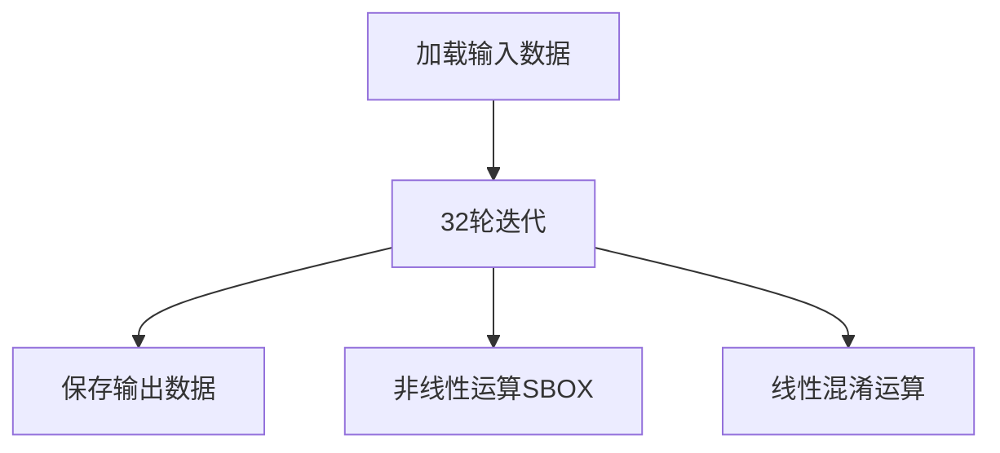

# 基于AES-NI的SM4算法优化实现

## 1. 原理介绍

### 1.1 方案的核心思想

Intel提出的SM4算法优化方案基于以下两个核心思想：
1. **使用SIMD指令进行多个分组数据的并行处理**：充分利用现代处理器的向量化处理能力
2. **使用AESENCLAST指令完成SM4的S变换**：通过同构映射将SM4的S盒运算转换为AES的S盒运算

AESENCLAST指令执行AES加密的最后一轮操作，包括：
S变换
行移位
异或子密钥

但该指令针对16字节（128位）数据操作，而SM4的S变换仅处理4字节（32位）。因此需要**4个SM4分组并行处理**（4×4字节=16字节）以匹配AESENCLAST指令的输入要求。

### 1.2 两个算法的S变换及同构映射

#### AES的S变换：
```
Sr(x) = Ar × Invr(x) + Cr
```

#### SM4的S变换：
```
Sm(x) = Am × Invm(Am(x) + Cm) + Cm
```

其中`Inv`运算是最复杂耗时的部分。AES有硬件指令支持，而SM4没有，因此需要通过**有限域同构映射**将SM4的元素映射到AES域进行计算。


### 1.3 用AES计算SM4的S变换详解

#### 1.3.1 利用AES的Inv计算SM4的Inv
```
Invm(y) = T⁻¹ × Invr(T(y))
```

#### 1.3.2 利用AES的S变换计算SM4的Inv
```
Invm(y) = T⁻¹ × Ar⁻¹ × (Sr(T(y)) + Cr) + T⁻¹ × Ar⁻¹ × Cr
```

#### 1.3.3 利用AES的S变换计算SM4的S变换
```
Sm(x) = Am × T⁻¹ × Ar⁻¹ × Sr(T(Am(x) + Cm)) + (Am × T⁻¹ × Ar⁻¹ × Cr + Cm)
```

#### 1.3.4 简化与修订
- **合并变换**：
  - 前变换：`T × Am(x) + T × Cm`
  - 后变换：`Am × T⁻¹ × Ar⁻¹ × Sr(...) + (Am × T⁻¹ × Ar⁻¹ × Cr + Cm)`
- **消除AESENCLAST副作用**：
  - 行移位：通过Shuffle指令去除
  - 子密钥异或：设置子密钥为0

### 1.4 SM4的S变换全流程整合

1. **前变换**：
   ```
   x₁ = T × Am(x) + T × Cm
   ```

2. **AES-NI指令**：
   ```
   x₂ = AESENCLAST(x₁, 0)  // 子密钥为0
   ```

3. **抵消行移位**：
   ```
   x₃ = Shuffle(x₂, ...)  // 通过Shuffle指令抵消行移位
   ```

4. **后变换**：
   ```
   x₄ = Am × T⁻¹ × Ar⁻¹ × x₃ + (Am × T⁻¹ × Ar⁻¹ × Cr + Cm)
   ```


## 2. 实现方案

### SM4-AES-NI实施方案

#### 输入：
- `Din`：4m比特输入数据（m=128/256/512）
- `K`：32×32×Z比特子密钥（Z=4m/128）

#### 输出：
- `Dout`：4m比特输出数据

#### 实现步骤：



### 2.1 加载输入数据

1. 将输入数据`Din`按128比特分组：
   ```
   Din = (B₀, B₁, ..., B_{Z-1})
   ```

2. 每个分组划分为4个32比特数据：
   ```
   Bⱼ = (X0ⱼ, X1ⱼ, X2ⱼ, X3ⱼ)
   ```

3. 重组为4个m比特数据：
   ```
   X0 = (X0₀, X0₁, ..., X0_{Z-1})
   X1 = (X1₀, X1₁, ..., X1_{Z-1})
   X2 = (X2₀, X2₁, ..., X2_{Z-1})
   X3 = (X3₀, X3₁, ..., X3_{Z-1})
   ```


### 2.2 32轮迭代

对轮计数器i = 0~31执行：

#### 2.2.1 加载轮密钥
1. 将子密钥`Kⱼ`划分为32个32比特：
   ```
   Kⱼ = (K0ⱼ, K1ⱼ, ..., K31ⱼ)
   ```
2. 取第i轮的m比特子密钥：
   ```
   rk_i = (Ki₀, Ki₁, ..., Ki_{Z-1})
   ```

#### 2.2.2 计算异或值
```
T = X1 ⊕ X2 ⊕ X3 ⊕ rk_i
```

#### 2.2.3 非线性运算SBOX
使用整合后的S变换流程：
```c
// 前变换
__m128i x1 = _mm_xor_si128(_mm_xor_si128(T_am, T_cm), zero);
// AESENCLAST指令
__m128i x2 = _mm_aesenclast_si128(x1, zero);
// 抵消行移位
__m128i x3 = _mm_shuffle_epi8(x2, shuffle_mask);
// 后变换
__m128i result = _mm_xor_si128(_mm_xor_si128(post_mul, post_add), zero);
```

#### 2.2.4 线性混淆运算
```
T = T ⊕ (T <<< 2) ⊕ (T <<< 10) ⊕ (T <<< 18) ⊕ (T <<< 24)
```
优化实现：
```c
// 计算 T ⊕ (T <<< 24)
__m128i part1 = _mm_xor_si128(T, _mm_rol_epi32(T, 24));

// 计算 (T ⊕ (T <<< 8) ⊕ (T <<< 16)) <<< 2
__m128i temp = _mm_xor_si128(T, _mm_rol_epi32(T, 8));
temp = _mm_xor_si128(temp, _mm_rol_epi32(T, 16));
__m128i part2 = _mm_rol_epi32(temp, 2);

// 合并结果
T = _mm_xor_si128(part1, part2);
```

#### 2.2.5 更新状态
```
(X0, X1, X2, X3) = (X1, X2, X3, X0 ⊕ T)
```

### 2.3 保存输出数据
最终输出：
```
Dout = (X₃₂, X₃₃, X₃₄, X₃₅)  // 32轮后的状态
```

## 3. 关键实现代码

### 3.1 S盒变换实现
```c
__m128i sm4_aesni_sbox(__m128i x) {
    // 前变换常数
    const __m128i T_am = _mm_set1_epi32(0x8e20faa0);
    const __m128i T_cm = _mm_set1_epi32(0x2e6c6901);
    const __m128i zero = _mm_setzero_si128();
    
    // 前变换: x1 = T × Am(x) + T × Cm
    __m128i x1 = _mm_xor_si128(_mm_xor_si128(_mm_and_si128(x, T_am), T_cm), zero);
    
    // AESENCLAST指令 (子密钥为0)
    __m128i x2 = _mm_aesenclast_si128(x1, zero);
    
    // 抵消行移位 (使用Shuffle指令)
    const __m128i shuffle_mask = _mm_setr_epi8(
        0, 5, 10, 15, 4, 9, 14, 3, 8, 13, 2, 7, 12, 1, 6, 11
    );
    __m128i x3 = _mm_shuffle_epi8(x2, shuffle_mask);
    
    // 后变换常数
    const __m128i post_mul = _mm_set1_epi32(0x0e79e9c1);
    const __m128i post_add = _mm_set1_epi32(0x6d2bcd30);
    
    // 后变换: result = Am × T⁻¹ × Ar⁻¹ × x3 + (Am × T⁻¹ × Ar⁻¹ × Cr + Cm)
    __m128i result = _mm_xor_si128(_mm_xor_si128(
        _mm_and_si128(x3, post_mul), post_add), zero);
    
    return result;
}
```

### 3.2 线性变换优化
```c
__m128i sm4_linear_transform(__m128i T) {
    // T ⊕ (T <<< 24)
    __m128i part1 = _mm_xor_si128(T, _mm_rol_epi32(T, 24));
    
    // (T ⊕ (T <<< 8) ⊕ (T <<< 16)) <<< 2
    __m128i temp = _mm_xor_si128(T, _mm_rol_epi32(T, 8));
    temp = _mm_xor_si128(temp, _mm_rol_epi32(T, 16));
    __m128i part2 = _mm_rol_epi32(temp, 2);
    
    // 合并结果
    return _mm_xor_si128(part1, part2);
}
```

### 3.3 主加密流程
```c
void sm4_aesni_encrypt(const uint8_t *input, uint8_t *output, const uint32_t *rk) {
    // 加载输入数据
    __m128i X0 = _mm_loadu_si128((const __m128i*)(input + 0));
    __m128i X1 = _mm_loadu_si128((const __m128i*)(input + 16));
    __m128i X2 = _mm_loadu_si128((const __m128i*)(input + 32));
    __m128i X3 = _mm_loadu_si128((const __m128i*)(input + 48));
    
    // 32轮迭代
    for (int i = 0; i < 32; i++) {
        // 加载轮密钥
        __m128i rk_i = _mm_set1_epi32(rk[i]);
        
        // T = X1 ⊕ X2 ⊕ X3 ⊕ rk_i
        __m128i T = _mm_xor_si128(X1, X2);
        T = _mm_xor_si128(T, X3);
        T = _mm_xor_si128(T, rk_i);
        
        // S盒变换
        T = sm4_aesni_sbox(T);
        
        // 线性变换
        T = sm4_linear_transform(T);
        
        // 更新状态: (X0, X1, X2, X3) = (X1, X2, X3, X0 ⊕ T)
        __m128i new_X0 = X1;
        X1 = X2;
        X2 = X3;
        X3 = _mm_xor_si128(X0, T);
        X0 = new_X0;
    }
    
    // 保存输出
    _mm_storeu_si128((__m128i*)(output + 0), X0);
    _mm_storeu_si128((__m128i*)(output + 16), X1);
    _mm_storeu_si128((__m128i*)(output + 32), X2);
    _mm_storeu_si128((__m128i*)(output + 48), X3);
}
```

## 4. 性能优化关键点

1. **SIMD并行处理**：
   - 使用128位(SSE)、256位(AVX2)或512位(AVX512)寄存器
   - 同时处理4/8/16个SM4分组

2. **指令级优化**：
   - 使用`AESENCLAST`指令加速S盒计算
   - 利用`PSHUFB`(Shuffle)指令处理字节排列
   - 通过`ROL`指令实现循环移位

3. **常数合并**：
   - 将同构映射中的常数合并为前变换和后变换常数
   - 减少内存访问和计算步骤

4. **寄存器重用**：
   - 最小化寄存器间的数据移动
   - 保持中间结果在寄存器中

**参考文献**  
kentle. SM4 AESNI指令集优化(intel).  
