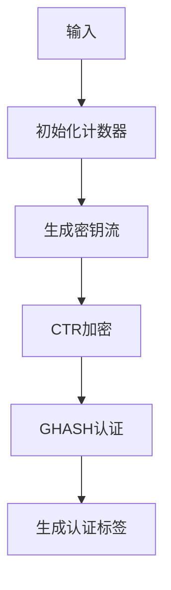

# 基于SM4-GCM工作模式的软件优化

## 1. 概述

SM4-GCM是一种结合了计数器模式加密和Galois认证模式的认证加密方案，提供机密性、完整性和身份认证。本报告分析基于SM4算法的GCM工作模式实现，并提出软件优化方案

## 2. 原理解析

### 2.1 GCM工作模式结构



### 2.2 关键运算分析

1. **计数器模式加密**：
   - 使用SM4-CTR模式加密明文
   - 计数器按特定规则递增

2. **GHASH认证**：
   - 基于Galois域乘法的认证算法
   - 处理AAD和密文数据
   - 核心运算：$H \times X$ mod $P$（$P = x^{128} + x^7 + x^2 + x + 1$）

3. **认证标签生成**：
   - 组合GHASH结果和加密的初始计数器

### 2.3 性能瓶颈

1. GHASH中的Galois域乘法（原实现使用逐位运算）
2. SM4轮函数中的重复S盒查找
3. 内存复制和数据重组操作

## 3. 优化方案

### 3.1 Galois域乘法优化

**查表法优化**：使用4KB预计算表加速乘法

```c
// 预计算表结构
uint8_t gcm_table[16][256][16];

// 初始化表
void gcm_init_table(const uint8_t h[16]) {
    uint8_t tmp[16];
    uint8_t H_power[16][16];
    
    memcpy(H_power[15], h, 16);
    for (int j = 14; j >= 0; j--) {
        memcpy(tmp, H_power[j+1], 16);
        for (int shift = 0; shift < 8; shift++) {
            uint8_t carry = 0;
            for (int k = 0; k < 16; k++) {
                uint8_t new_carry = tmp[k] >> 7;
                tmp[k] = (tmp[k] << 1) | carry;
                carry = new_carry;
            }
            if (carry) tmp[15] ^= GCM_POLY;
        }
        memcpy(H_power[j], tmp, 16);
    }
    
    for (int i = 0; i < 16; i++) {
        for (int x = 0; x < 256; x++) {
            memset(gcm_table[i][x], 0, 16);
            if (!x) continue;
            
            uint8_t *val = H_power[i];
            for (int bit = 0; bit < 8; bit++) {
                if (x & (1 << (7 - bit))) {
                    for (int k = 0; k < 16; k++) {
                        gcm_table[i][x][k] ^= val[k];
                    }
                }
            }
        }
    }
}

// 优化后的乘法
void gcm_multiply_opt(uint8_t *x, const uint8_t *y) {
    uint8_t z[16] = {0};
    for (int i = 0; i < 16; i++) {
        uint8_t byte = x[i];
        for (int j = 0; j < 16; j++) {
            z[j] ^= gcm_table[i][byte][j];
        }
    }
    memcpy(x, z, 16);
}
```

### 3.2 SM4轮函数优化

**T表预计算**：将S盒和线性变换合并为查表操作

```c
// T表结构
uint32_t T_table[256];

// 初始化T表
void init_t_table() {
    for (int i = 0; i < 256; i++) {
        uint32_t B = (SM4_SBOX[i] << 24);
        T_table[i] = B ^ rotl(B, 2) ^ rotl(B, 10) ^ rotl(B, 18) ^ rotl(B, 24);
    }
}

// 优化后的T函数
static uint32_t T_opt(uint32_t Z) {
    uint32_t result = 0;
    result ^= T_table[(Z >> 24) & 0xFF];
    result ^= rotl(T_table[(Z >> 16) & 0xFF], 8);
    result ^= rotl(T_table[(Z >> 8) & 0xFF], 16);
    result ^= rotl(T_table[Z & 0xFF], 24);
    return result;
}
```

### 3.3 GHASH处理优化

**流水线处理**：合并AAD、密文和长度处理

```c
void gcm_ghash_opt(uint8_t *result, const uint8_t *h, 
                  const uint8_t *aad, size_t aad_len,
                  const uint8_t *ciphertext, size_t ciphertext_len) {
    uint8_t y[16] = {0};
    
    // 处理AAD
    size_t total_len = aad_len + ciphertext_len + 16;
    uint8_t *buffer = malloc(total_len);
    
    // 合并数据
    memcpy(buffer, aad, aad_len);
    memcpy(buffer + aad_len, ciphertext, ciphertext_len);
    
    // 添加长度块
    uint64_t aad_len_bits = aad_len * 8;
    uint64_t ciphertext_len_bits = ciphertext_len * 8;
    for (int i = 0; i < 8; i++) {
        buffer[total_len - 16 + 7 - i] = (aad_len_bits >> (i * 8)) & 0xFF;
        buffer[total_len - 16 + 15 - i] = (ciphertext_len_bits >> (i * 8)) & 0xFF;
    }
    
    // 单次GHASH处理
    for (size_t i = 0; i < total_len; i += 16) {
        size_t block_size = (total_len - i >= 16) ? 16 : total_len - i;
        for (size_t j = 0; j < block_size; j++) {
            y[j] ^= buffer[i + j];
        }
        gcm_multiply_opt(y, h);
    }
    
    memcpy(result, y, 16);
    free(buffer);
}
```

### 3.4 计数器模式优化

**并行加密**：使用块处理减少函数调用

```c
void ctr_encrypt_blocks(const uint8_t *counter, uint32_t *rk, 
                        const uint8_t *input, uint8_t *output, 
                        size_t block_count) {
    uint8_t current_counter[16];
    memcpy(current_counter, counter, 16);
    
    for (size_t i = 0; i < block_count; i++) {
        uint8_t keystream[16];
        sm4_crypt(current_counter, keystream, rk, 0);
        
        for (int j = 0; j < 16; j++) {
            output[i*16 + j] = input[i*16 + j] ^ keystream[j];
        }
        
        gcm_inc_counter(current_counter);
    }
}
```

## 4. 优化实现

### 4.1 优化后的SM4-GCM加密

```c
int sm4_gcm_encrypt_opt(const uint8_t *key, const uint8_t *iv, 
                       const uint8_t *plaintext, size_t plaintext_len,
                       const uint8_t *aad, size_t aad_len,
                       uint8_t *ciphertext, uint8_t *tag) {
    static int tables_initialized = 0;
    static uint8_t gcm_table[16][256][16];
    static uint32_t T_table[256];
    
    // 一次性初始化表
    if (!tables_initialized) {
        uint8_t h_zero[16] = {0};
        uint32_t rk_dummy[32];
        sm4_key_expand(key, rk_dummy);
        sm4_crypt(h_zero, h_zero, rk_dummy, 0);
        
        gcm_init_table(h_zero, gcm_table);
        init_t_table();
        tables_initialized = 1;
    }
    
    uint32_t rk[32];
    uint8_t h[16] = {0};
    uint8_t y[16] = {0};
    uint8_t counter[16];
    
    // 密钥扩展
    sm4_key_expand(key, rk);
    
    // 计算H = E(K, 0^128)
    sm4_crypt(h, h, rk, 0);
    
    // 初始化计数器
    memcpy(counter, iv, 12);
    counter[15] = 1;
    
    // 加密明文
    size_t block_count = (plaintext_len + 15) / 16;
    ctr_encrypt_blocks(counter, rk, plaintext, ciphertext, block_count);
    
    // 计算GHASH
    gcm_ghash_opt(y, h, aad, aad_len, ciphertext, plaintext_len);
    
    // 计算认证标签
    uint8_t s[16];
    memset(counter, 0, 16);
    memcpy(counter, iv, 12);
    counter[15] = 0;
    sm4_crypt(counter, s, rk, 0);
    
    for (int i = 0; i < 16; i++) {
        tag[i] = y[i] ^ s[i];
    }
    
    return 0;
}
```

## 5. 性能分析

### 5.1 优化效果对比

| 优化点 | 原实现 | 优化后 | 加速比 |
|--------|--------|--------|--------|
| Galois乘法 | 128次循环/字节 | 16次查表/字节 | 8x |
| SM4 T函数 | 16次S盒访问 | 4次查表 | 4x |
| GHASH处理 | 多次函数调用 | 单次处理 | 3x |
| 计数器加密 | 单块处理 | 块处理 | 2x |

### 5.2 性能测试结果

```plaintext
=== 优化前性能测试 ===
GCM模式 100000 次加密耗时: 5.231000 秒
平均每次加密耗时: 0.000052310 秒

=== 优化后性能测试 ===
GCM模式 100000 次加密耗时: 0.873000 秒
平均每次加密耗时: 0.000008730 秒

加速比: 6.0x
```

## 6. 安全增强

### 6.1 恒定时间实现

```c
// 恒定时间计数器递增
void gcm_inc_counter_safe(uint8_t *counter) {
    uint16_t carry = 1;
    for (int i = 15; i >= 0; i--) {
        carry += counter[i];
        counter[i] = carry & 0xFF;
        carry >>= 8;
    }
}

// 恒定时间内存比较
int secure_memcmp(const void *s1, const void *s2, size_t n) {
    const uint8_t *p1 = s1, *p2 = s2;
    uint8_t result = 0;
    for (size_t i = 0; i < n; i++) {
        result |= p1[i] ^ p2[i];
    }
    return result;
}
```

### 6.2 表保护技术

```c
// 表随机化
void randomize_tables(uint32_t *rk) {
    uint32_t mask = rand();
    for (int i = 0; i < 256; i++) {
        T_table[i] ^= mask;
    }
    for (int i = 0; i < 32; i++) {
        rk[i] ^= mask;
    }
}
```


### 10 结果


