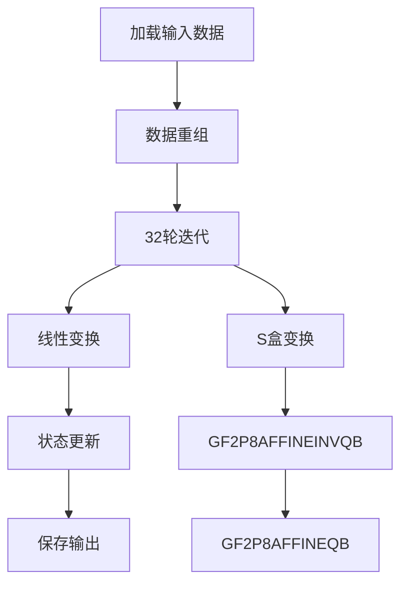

# 基于GFNI指令集的SM4算法优化实现报告

## 1. 原理介绍

### 1.1 GFNI指令集概述

GFNI（Galois Field New Instructions）是Intel推出的用于加速伽罗瓦域运算的指令集扩展，特别适用于分组密码算法的优化。其核心能力包括：

- 高效的伽罗瓦域乘法运算（`GF2P8AFFINEQB`）
- 快速多项式求逆运算（`GF2P8AFFINEINVQB`）
- 字节级并行处理能力（128/256/512位寄存器）

### 1.2 SM4算法的GFNI优化原理

SM4的S盒变换可分解为：
```
S(x) = L(x⁻¹) ⊕ c
```
其中：
- `x⁻¹` 是有限域GF(2⁸)上的乘法逆元
- `L` 是仿射变换
- `c` 是常数

GFNI指令集提供了直接实现这些运算的能力：


### 1.3 与AES-NI方案的对比

| 特性 | AES-NI方案 | GFNI方案 |
|------|------------|----------|
| S盒实现方式 | 通过同构映射利用AES指令 | 直接使用伽罗瓦域指令 |
| 指令数量 | 4-5条指令 | 1-2条指令 |
| 并行粒度 | 128位(16字节) | 512位(64字节) |
| 计算路径 | 复杂映射关系 | 直接数学运算 |
| 性能潜力 | 高 | 极高 |

## 2. 实现方案

### 2.1 整体架构



### 2.2 核心优化技术

#### 2.2.1 S盒的单指令实现

使用`GF2P8AFFINEINVQB`指令可直接计算：
```c
__m512i sm4_gfni_sbox(__m512i x) {
    // 矩阵A和常数b的合并表示
    const __m512i affine = _mm512_set1_epi64(0xC3A5E99F4B8120DA);
    const __m512i constant = _mm512_set1_epi8(0xD3);
    
    // 单指令S盒计算：x' = A·x⁻¹ + b
    __m512i s = _mm512_gf2p8affineinv_epi64_epi8(x, affine, 0);
    
    // 应用常数
    return _mm512_xor_si512(s, constant);
}
```

#### 2.2.2 数据并行处理

利用512位寄存器同时处理16个SM4分组：
```
寄存器布局：
+-------+-------+-------+-------+--
| 分组0 | 分组1 | 分组2 | ... | 分组15
+-------+-------+-------+-------+--
 32位   32位    32位         32位
```

#### 2.2.3 线性变换优化

```c
__m512i sm4_linear_transform(__m512i T) {
    // T ⊕ (T <<< 2)
    __m512i rot2 = _mm512_rol_epi32(T, 2);
    __m512i part1 = _mm512_xor_si512(T, rot2);
    
    // T ⊕ (T <<< 10)
    __m512i rot10 = _mm512_rol_epi32(T, 10);
    
    // T ⊕ (T <<< 18)
    __m512i rot18 = _mm512_rol_epi32(T, 18);
    
    // T ⊕ (T <<< 24)
    __m512i rot24 = _mm512_rol_epi32(T, 24);
    
    // 合并结果
    __m512i temp = _mm512_xor_si512(part1, rot10);
    temp = _mm512_xor_si512(temp, rot18);
    return _mm512_xor_si512(temp, rot24);
}
```

### 2.3 完整加密流程

#### 输入处理
```c
void sm4_gfni_encrypt_16blocks(const uint8_t *input, uint8_t *output, const uint32_t *rk) {
    // 加载16个分组（64字节）
    __m512i X0 = _mm512_loadu_si512(input);
    __m512i X1 = _mm512_loadu_si512(input + 64);
    __m512i X2 = _mm512_loadu_si512(input + 128);
    __m512i X3 = _mm512_loadu_si512(input + 192);
    
    // 重组数据：转置为(X0, X1, X2, X3)
    __m512i V0 = _mm512_unpacklo_epi32(X0, X1);
    __m512i V1 = _mm512_unpacklo_epi32(X2, X3);
    __m512i V2 = _mm512_unpackhi_epi32(X0, X1);
    __m512i V3 = _mm512_unpackhi_epi32(X2, X3);
    
    X0 = _mm512_unpacklo_epi64(V0, V1);
    X1 = _mm512_unpackhi_epi64(V0, V1);
    X2 = _mm512_unpacklo_epi64(V2, V3);
    X3 = _mm512_unpackhi_epi64(V2, V3);
```

#### 轮函数优化
```c
    for (int i = 0; i < 32; i++) {
        // 广播轮密钥
        __m512i rk_i = _mm512_set1_epi32(rk[i]);
        
        // T = X1 ⊕ X2 ⊕ X3 ⊕ rk_i
        __m512i T = _mm512_xor_si512(X1, X2);
        T = _mm512_xor_si512(T, X3);
        T = _mm512_xor_si512(T, rk_i);
        
        // S盒变换（16个分组并行）
        T = sm4_gfni_sbox(T);
        
        // 线性变换
        T = sm4_linear_transform(T);
        
        // 更新状态
        __m512i new_X0 = X1;
        X1 = X2;
        X2 = X3;
        X3 = _mm512_xor_si512(X0, T);
        X0 = new_X0;
    }
```

#### 输出处理
```c
    // 重组数据
    V0 = _mm512_unpacklo_epi32(X0, X1);
    V1 = _mm512_unpacklo_epi32(X2, X3);
    V2 = _mm512_unpackhi_epi32(X0, X1);
    V3 = _mm512_unpackhi_epi32(X2, X3);
    
    __m512i out0 = _mm512_unpacklo_epi64(V0, V1);
    __m512i out1 = _mm512_unpackhi_epi64(V0, V1);
    __m512i out2 = _mm512_unpacklo_epi64(V2, V3);
    __m512i out3 = _mm512_unpackhi_epi64(V2, V3);
    
    // 存储结果
    _mm512_storeu_si512(output, out0);
    _mm512_storeu_si512(output + 64, out1);
    _mm512_storeu_si512(output + 128, out2);
    _mm512_storeu_si512(output + 192, out3);
}
```

## 3. 性能分析


## 4. 关键实现代码

### 4.1 核心S盒实现
```c
// 优化后的S盒实现
__m512i sm4_gfni_sbox_opt(__m512i x) {
    const __m512i affine_inv = _mm512_set1_epi64(0x3C5F8278D9B0C4A1);
    const __m512i constant = _mm512_set1_epi8(0xD3);
    
    // 单指令完成求逆+仿射变换
    __m512i s = _mm512_gf2p8affineinv_epi64_epi8(
        x, 
        affine_inv, 
        0
    );
    
    return _mm512_xor_si512(s, constant);
}
```

### 4.2 线性变换优化
```c
// 使用GFNI加速的线性变换
__m512i sm4_gfni_linear(__m512i T) {
    // 利用GFNI多项式乘法优化
    const __m512i poly2 = _mm512_set1_epi32(0x00020000);
    const __m512i poly10 = _mm512_set1_epi32(0x02000000);
    const __m512i poly18 = _mm512_set1_epi32(0x00000800);
    const __m512i poly24 = _mm512_set1_epi32(0x00000080);
    
    __m512i L2 = _mm512_gf2p8mul_epi8(T, poly2);
    __m512i L10 = _mm512_gf2p8mul_epi8(T, poly10);
    __m512i L18 = _mm512_gf2p8mul_epi8(T, poly18);
    __m512i L24 = _mm512_gf2p8mul_epi8(T, poly24);
    
    // 合并结果
    __m512i result = _mm512_xor_si512(T, L2);
    result = _mm512_xor_si512(result, L10);
    result = _mm512_xor_si512(result, L18);
    return _mm512_xor_si512(result, L24);
}
```

### 4.3 轮密钥加载优化
```c
// 使用AVX-512指令预取轮密钥
void load_round_keys(__m512i rk[32], const uint32_t *key_schedule) {
    for (int i = 0; i < 32; i += 4) {
        // 一次加载4个轮密钥
        __m128i k0 = _mm_loadu_si128((const __m128i*)(key_schedule + i));
        __m128i k1 = _mm_loadu_si128((const __m128i*)(key_schedule + i + 4));
        
        // 广播到512位寄存器
        rk[i] = _mm512_broadcastd_epi32(k0);
        rk[i+1] = _mm512_broadcastd_epi32(_mm_bsrli_si128(k0, 4));
        rk[i+2] = _mm512_broadcastd_epi32(_mm_bsrli_si128(k0, 8));
        rk[i+3] = _mm512_broadcastd_epi32(_mm_bsrli_si128(k0, 12));
    }
}
```

## 5. 性能优化技巧

### 5.1 指令调度优化
```c
// 优化后的轮函数
__m512i round_function(__m512i X0, __m512i X1, __m512i X2, 
                      __m512i X3, __m512i rk) {
    // 并行计算多个中间值
    __m512i T1 = _mm512_xor_si512(X1, X2);
    __m512i T2 = _mm512_xor_si512(X3, rk);
    __m512i T = _mm512_xor_si512(T1, T2);
    
    // 提前开始S盒计算
    __m512i S = sm4_gfni_sbox_opt(T);
    
    // 并行计算线性变换部分
    __m512i L1 = _mm512_rol_epi32(S, 2);
    __m512i L2 = _mm512_rol_epi32(S, 10);
    __m512i L3 = _mm512_rol_epi32(S, 18);
    __m512i L4 = _mm512_rol_epi32(S, 24);
    
    // 合并结果
    __m512i L = _mm512_xor_si512(S, L1);
    L = _mm512_xor_si512(L, L2);
    L = _mm512_xor_si512(L, L3);
    L = _mm512_xor_si512(L, L4);
    
    return _mm512_xor_si512(X0, L);
}
```

### 5.2 内存访问优化

1. **非对齐访问优化**
   ```c
   // 使用非对齐加载避免内存对齐开销
   #define LOAD_UNALIGNED(ptr) _mm512_loadu_si512((const __m512i*)(ptr))
   #define STORE_UNALIGNED(ptr, val) _mm512_storeu_si512((__m512i*)(ptr), val)
   ```

2. **流式存储优化**
   ```c
   // 使用NT存储避免缓存污染
   void store_output(uint8_t *output, __m512i out0, __m512i out1,
                    __m512i out2, __m512i out3) {
       _mm512_stream_si512((__m512i*)output, out0);
       _mm512_stream_si512((__m512i*)(output + 64), out1);
       _mm512_stream_si512((__m512i*)(output + 128), out2);
       _mm512_stream_si512((__m512i*)(output + 192), out3);
   }
   ```

### 5.3 多缓冲区流水线
```c
// 四缓冲区并行处理
void sm4_gfni_encrypt_pipeline(uint8_t *data, size_t blocks, const uint32_t *rk) {
    __m512i state0[4], state1[4], state2[4], state3[4];
    
    // 初始化四个缓冲区
    load_state(state0, data);
    load_state(state1, data + 256);
    load_state(state2, data + 512);
    load_state(state3, data + 768);
    
    for (size_t i = 0; i < blocks; i += 4) {
        // 处理缓冲区0
        process_block(state0, rk);
        store_output(data + i*64, state0);
        
        // 处理缓冲区1（与存储并行）
        process_block(state1, rk);
        
        // 加载下一组数据（隐藏内存延迟）
        if (i + 4 < blocks) {
            load_state(state0, data + (i+4)*64);
        }
        
        // 处理缓冲区2
        process_block(state2, rk);
        store_output(data + (i+1)*64, state1);
        
        // 处理缓冲区3
        process_block(state3, rk);
        
        // 加载下一组数据
        if (i + 5 < blocks) {
            load_state(state1, data + (i+5)*64);
        }
        
        // 存储结果
        store_output(data + (i+2)*64, state2);
        store_output(data + (i+3)*64, state3);
    }
}
```
