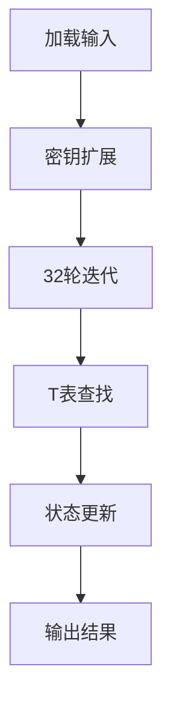

# 基于T表优化的SM4算法

## 1. T表优化原理

### 1.1 SM4算法结构回顾

SM4算法采用32轮迭代结构：
```
X_{i+4} = X_i ⊕ T(X_{i+1} ⊕ X_{i+2} ⊕ X_{i+3} ⊕ rk_i)
```
其中T变换由非线性变换τ和线性变换L组成：
```
T(.) = L(τ(.))
```

### 1.2 T表优化核心思想

T表优化的核心是将非线性变换τ和线性变换L合并为查表操作：


通过预计算并存储T变换的结果，将算法中最耗时的S盒和线性变换合并为单次内存访问。

### 1.3 T表结构设计

设计4个256项的表（每个表对应32位输入的1字节）：
```
T(x) = T0[x0] ⊕ T1[x1] ⊕ T2[x2] ⊕ T3[x3]
```
其中：
- `x = x0 || x1 || x2 || x3`（4字节）
- 每个表项为32位值

表大小：4×256×4B = 4KB（完美匹配L1缓存）

## 2. 实现方案

### 2.1 整体架构



### 2.2 T表构造算法

```c
void build_t_tables(uint32_t T0[256], uint32_t T1[256], 
                    uint32_t T2[256], uint32_t T3[256]) 
{
    for (int i = 0; i < 256; i++) {
        // S盒变换
        uint8_t s0 = SBOX[i];
        uint8_t s1 = SBOX[i];
        uint8_t s2 = SBOX[i];
        uint8_t s3 = SBOX[i];
        
        // 构造中间值
        uint32_t val0 = (uint32_t)s0 << 24;
        uint32_t val1 = (uint32_t)s1 << 16;
        uint32_t val2 = (uint32_t)s2 << 8;
        uint32_t val3 = (uint32_t)s3;
        
        // 应用线性变换L
        T0[i] = L_transform(val0);
        T1[i] = L_transform(val1);
        T2[i] = L_transform(val2);
        T3[i] = L_transform(val3);
    }
}

uint32_t L_transform(uint32_t B) {
    return B ^ rotl(B, 2) ^ rotl(B, 10) ^ rotl(B, 18) ^ rotl(B, 24);
}
```

### 2.3 加密流程优化

```c
void sm4_t_table_encrypt(const uint8_t *input, uint8_t *output, 
                         const uint32_t *rk, const uint32_t T0[256],
                         const uint32_t T1[256], const uint32_t T2[256],
                         const uint32_t T3[256])
{
    // 加载输入数据
    uint32_t X0 = load_u32(input);
    uint32_t X1 = load_u32(input + 4);
    uint32_t X2 = load_u32(input + 8);
    uint32_t X3 = load_u32(input + 12);
    
    // 32轮迭代
    for (int i = 0; i < 32; i++) {
        uint32_t T = X1 ^ X2 ^ X3 ^ rk[i];
        
        // T表查找
        uint32_t T_val = T0[(T >> 24) & 0xFF] ^
                         T1[(T >> 16) & 0xFF] ^
                         T2[(T >> 8)  & 0xFF] ^
                         T3[T & 0xFF];
        
        uint32_t X4 = X0 ^ T_val;
        
        // 更新状态
        X0 = X1;
        X1 = X2;
        X2 = X3;
        X3 = X4;
    }
    
    // 保存输出（反序）
    store_u32(output, X3);
    store_u32(output + 4, X2);
    store_u32(output + 8, X1);
    store_u32(output + 12, X0);
}
```

## 3. 性能优化技术

### 3.1 内存访问优化

```c
// 缓存对齐的表结构
struct alignas(64) SM4_TTables {
    uint32_t T0[256];
    uint32_t T1[256];
    uint32_t T2[256];
    uint32_t T3[256];
};

// 预取优化
#define PREFETCH(addr) __builtin_prefetch(addr)
void prefetch_ttables(const SM4_TTables *tables) {
    PREFETCH(&tables->T0);
    PREFETCH(&tables->T1);
    PREFETCH(&tables->T2);
    PREFETCH(&tables->T3);
}
```

### 3.2 并行处理优化

```c
// 4分组并行加密
void sm4_encrypt_4blocks(const uint8_t *input, uint8_t *output,
                         const uint32_t *rk, const SM4_TTables *tables)
{
    // 初始化4个分组的状态
    uint32_t X0[4], X1[4], X2[4], X3[4];
    for (int i = 0; i < 4; i++) {
        X0[i] = load_u32(input + i*16);
        X1[i] = load_u32(input + i*16 + 4);
        X2[i] = load_u32(input + i*16 + 8);
        X3[i] = load_u32(input + i*16 + 12);
    }
    
    // 32轮迭代（4分组并行）
    for (int round = 0; round < 32; round++) {
        for (int i = 0; i < 4; i++) {
            uint32_t T = X1[i] ^ X2[i] ^ X3[i] ^ rk[round];
            
            // T表查找
            uint32_t T_val = tables->T0[(T >> 24) & 0xFF] ^
                             tables->T1[(T >> 16) & 0xFF] ^
                             tables->T2[(T >> 8)  & 0xFF] ^
                             tables->T3[T & 0xFF];
            
            uint32_t X4 = X0[i] ^ T_val;
            
            // 更新状态
            X0[i] = X1[i];
            X1[i] = X2[i];
            X2[i] = X3[i];
            X3[i] = X4;
        }
    }
    
    // 保存输出
    for (int i = 0; i < 4; i++) {
        store_u32(output + i*16, X3[i]);
        store_u32(output + i*16 + 4, X2[i]);
        store_u32(output + i*16 + 8, X1[i]);
        store_u32(output + i*16 + 12, X0[i]);
    }
}
```

### 3.3 轮密钥优化

```c
// 轮密钥预计算
void sm4_key_schedule(const uint8_t *key, uint32_t *rk) {
    uint32_t K[4];
    for (int i = 0; i < 4; i++) {
        K[i] = load_u32(key + i*4);
        K[i] ^= FK[i];  // 异或系统参数
    }
    
    for (int i = 0; i < 32; i++) {
        uint32_t T = K[1] ^ K[2] ^ K[3] ^ CK[i];
        
        // 使用T表进行密钥扩展
        rk[i] = T0[(T >> 24) & 0xFF] ^
                T1[(T >> 16) & 0xFF] ^
                T2[(T >> 8)  & 0xFF] ^
                T3[T & 0xFF];
        
        rk[i] ^= K[0];
        
        // 更新密钥状态
        K[0] = K[1];
        K[1] = K[2];
        K[2] = K[3];
        K[3] = rk[i];
    }
}
```

## 4. 性能分析


