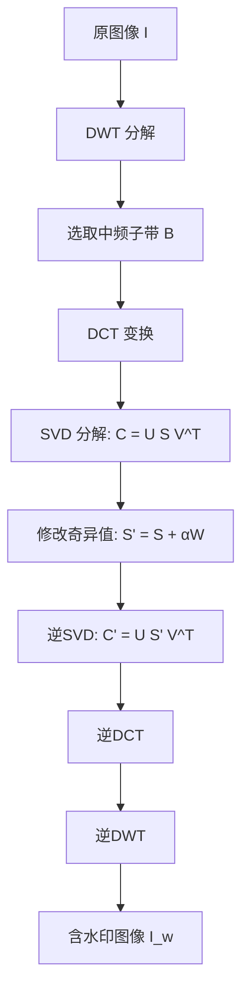
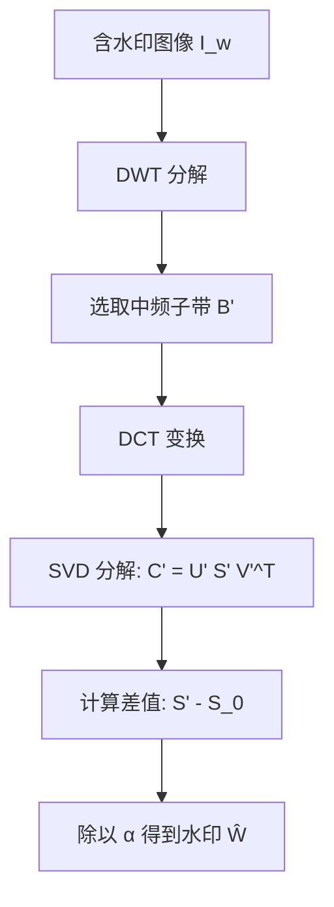

# 基于数字水印的图片泄露检测系统

## 项目概述

本项目是基于开源项目 `blind_watermark` 进行二次开发的数字水印检测系统
## 项目要求

1. **基于数字水印的图片泄露检测**
2. **编程实现图片水印嵌入和提取**（可依托开源项目二次开发）
3. **进行鲁棒性测试**，包括不限于翻转、平移、截取、调对比度等
### 1. 算法原理概述

本实验实现了一种**盲水印**算法，核心是将水印信息嵌入到**DWT 中频子带的 DCT 域奇异值**中。
这种 **DWT–DCT–SVD** 混合频域方法兼具鲁棒性与不可见性，适用于数字图像版权保护。

主要思想：

1. **DWT** 分离不同频率成分 → 选择中频子带嵌入水印
2. **DCT** 将信号能量集中 → 在中频系数修改水印信息
3. **SVD** 在奇异值域嵌入水印 → 稳定性高，不易被噪声或几何变换破坏

---

### 2. 算法实现的原理

#### 2.1 离散小波变换

二维 DWT 将图像 $I(x,y)$ 分解为四个子带：

$$
\{LL, LH, HL, HH\}
$$

LL 为低频近似信息，LH/HL 为中频，HH 为高频细节。

选择中频子带（如 LH）嵌入水印的理由：

* 低频 → 容易被察觉
* 高频 → 容易在压缩中丢失
* 中频 → 折中方案，鲁棒且不可见

---

#### 2.2 离散余弦变换

二维 DCT 变换：

$$
F(u,v) = \alpha(u)\alpha(v) \sum_{x=0}^{M-1} \sum_{y=0}^{N-1} f(x,y) 
\cos\left[ \frac{(2x+1)u\pi}{2M} \right]
\cos\left[ \frac{(2y+1)v\pi}{2N} \right]
$$

DCT 将空间域信号分解为不同频率分量，中频区域既稳定又隐蔽。

---

#### 2.3 奇异值分解

对 DCT 系数矩阵 $C$：

$$
C = U S V^T
$$

* $S$ 的奇异值稳定且与图像视觉质量相关
* 改变奇异值不会显著影响视觉感受

---

#### 2.4 嵌入过程

1. 原图像 $I$ → DWT → 选取中频子带 $B$
2. $B$ → DCT → 得到系数矩阵 $C$
3. $C$ → SVD 分解：

$$
C = U S V^T
$$

4. 嵌入水印 $W$：

$$
S' = S + \alpha W
$$

其中 $\alpha$ 为嵌入强度。
5\. 重构：

$$
C' = U S' V^T
$$

6. 逆 DCT、逆 DWT → 含水印图像 $I_w$

---

#### 2.5 提取过程（盲提取）

1. 含水印图像 $I_w$ → DWT → 选中频子带 $B'$
2. $B'$ → DCT → 得到 $C'$
3. $C'$ → SVD 分解：

$$
C' = U' S' V'^T
$$

4. 提取水印：

$$
\hat{W} = \frac{S' - S_0}{\alpha}
$$

其中 $S_0$ 可由密钥生成，无需原图。

---

### 3. 嵌入与提取流程图

#### 3.1 嵌入流程图

#### 3.2 提取流程图

---

### 6. 总结

DWT–DCT–SVD 混合盲水印算法在保持高不可见性的同时，能有效抵抗 JPEG 压缩、噪声、旋转、裁剪等攻击，适合版权保护与防篡改应用

## 核心功能

### 1. 水印嵌入和提取
- **文本水印**：支持任意文本内容的水印嵌入和提取
- **图片水印**：支持图片格式的水印嵌入和提取
- **多种模式**：支持 `text`、`image`、`bit` 三种水印模式

### 2. 鲁棒性测试
- **几何攻击**：旋转、缩放、平移、裁剪、翻转
- **信号处理攻击**：亮度调整、对比度调整、噪声添加
- **压缩攻击**：JPEG压缩、PNG压缩
- **滤波攻击**：高斯模糊、中值滤波、双边滤波
- **组合攻击**：多种攻击的组合测试

### 3. 泄露检测
- **水印验证**：通过水印信息验证图像是否被篡改
- **相似度比较**：支持图片水印的相似度比较

## 技术特点

### 1. 算法优势
 **DWT-DCT-SVD**：采用先进的数字水印算法

 **多级分解**：小波变换提供多分辨率分析

 **频域嵌入**：在DCT域进行水印嵌入，提高鲁棒性

 **SVD分解**：利用奇异值分解的稳定性

### 2. 鲁棒性保障
 **多种攻击测试**：覆盖常见的图像处理攻击

 **参数随机化**：每次测试使用不同的攻击参数

 **组合攻击**：测试多种攻击的组合效果

 **结果验证**：自动验证攻击后的水印提取效果

